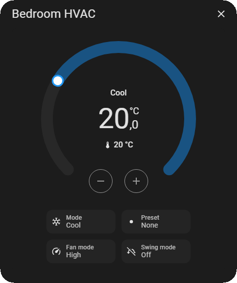

  
 <div align="center">

  [](https://github.com/hacs/integration)
  [](https://www.gnu.org/licenses/agpl-3.0)
  [](#)

  

  

  <p align="center">
    <strong>Show any Home Assistant dashboard view as a popup.<br>
            Design the popup visually in the normal dashboard editor -<br>
            no layout-card, no grid-area YAML, no browser_mod dependency.</strong>
  </p>

  <p align="center">
    <a href="#introduction">Introduction</a> •
    <a href="#key-features">Key Features</a> •
    <a href="#installation">Installation</a> •
    <a href="#usage">Usage</a> •
    <a href="#license">License</a>
  </p>

</div>

---

**Chrono Popup** fills a gap browser_mod's popup feature doesn't cover: showing an entire dashboard **view** - built visually, with HA's own dashboard editor - inside a popup. Instead of hand-assembling `layout-card`, `conditional`, and `grid-area` YAML to fake a custom popup layout, you design a normal subview the way you'd design any other page, then point the popup at it.

Chrono Popup is **not a card**. There's no `type: custom:chrono-popup` you place on a dashboard, no visual editor, and it won't appear in the "+ Add Card" picker. It's a resource: once loaded, any `tap_action` anywhere - a button, a tile, any card at all - can open the popup by firing a small event. Nothing to place, nothing to configure ahead of time; every popup is defined at the moment it's triggered.

---

## 📋 Table of Contents

- [Introduction](#introduction)
- [Key Features](#key-features)
- [Installation](#installation)
  - [HACS (Recommended)](#hacs-recommended)
  - [Manual Installation](#manual-installation)
- [Uninstallation](#uninstallation)
- [Usage](#usage)
  - [Trigger Syntax](#trigger-syntax)
  - [Recognized Keys](#recognized-keys)
  - [The `view` Path](#the-view-path)
  - [Styling](#styling)
- [Limitations](#limitations)
- [License](#license)
- [Support](#support)

---

## 🚀 Key Features

### 🖼️ Design Popups Visually
The popup's content is a real dashboard view, built in HA's own visual editor - not hand-written YAML fighting `layout-card` and `grid-template-areas` to fake a layout. If you can build it as a view, you can show it as a popup.

### 🧩 Any View Type
Panel, masonry, sections, sidebar - all rendered through Home Assistant's own view layout element, not reimplemented from scratch. Whatever layout the view uses on a normal dashboard is exactly what renders inside the popup.

### 🔄 Genuinely Live
Conditional cards, template sensors, anything that depends on live state - all update in real time while the popup is open, the same as they would on a normal dashboard page.

### 📐 Auto-Sizing by Default
The popup sizes itself to fit its content automatically, with sensible min/max caps so it never overflows the screen. No need to calculate pixel dimensions up front.

### 🎨 One Escape Hatch for All Styling
Every visual property - size, background, border, radius, anything - is set through a single `styles:` block using real CSS property names, including CSS custom properties. No separate named fields to remember, no guessing which property lives where.

### 🚫 Zero Dependencies
No browser_mod required. Chrono Popup handles its own trigger mechanism, its own popup chrome, and its own view resolution independently.

### 🔒 Respects View Visibility
If a view is restricted to specific users in the dashboard editor, that restriction is respected here too - a view hidden from a user stays hidden inside the popup.

---

## 📦 Installation

### HACS (Recommended)

1. Open **HACS** in your Home Assistant instance.
2. Navigate to **Frontend** and click the three-dot menu in the top right corner.
3. Select **Custom repositories**.
4. Enter `https://github.com/rob-vandenberg/chrono-popup` and select **Lovelace** as the category.
5. Click **Add**. The repository will appear in the list.
6. Search for `Chrono Popup` and click **Download**.
7. Reload your browser.

Chrono Popup is a resource, not a card - there's no card to add to a dashboard afterward. Once the resource is loaded, it's ready to be triggered from any `tap_action`.

### Manual Installation

1. Download `chrono-popup.js` from the [latest release](https://github.com/rob-vandenberg/chrono-popup/releases/latest).
2. Copy it to your Home Assistant `config/www/` folder.
3. In Home Assistant, go to **Settings → Dashboards → Resources**.
4. Click **Add Resource**.
5. Enter `/local/chrono-popup.js` as the URL and select **JavaScript Module**.
6. Click **Create** and reload your browser.

---

## 🗑️ Uninstallation

### Via HACS
1. Open **HACS → Frontend**.
2. Find **Chrono Popup** and click the three-dot menu.
3. Select **Remove**.
4. Reload your browser.

### Manual
1. Delete `chrono-popup.js` from `config/www/`.
2. Remove the resource entry from **Settings → Dashboards → Resources**.

---



---

## ⚙️ Usage

### Trigger Syntax

Any card's `tap_action` can open a popup via `fire-dom-event`:

```yaml
tap_action:
  action: fire-dom-event
  chrono-popup:
    data:
      title: "Hello, world!"
      view: "/dashboard-test/uren-panel"
      dismissable: true
      styles:
        frame:
          width: 640px
          height: 580px
          background: "#000000"
          border-radius: 50px
        header:
          padding: 8px 8px 0 8px
```

### Recognized Keys

| Key | Type | Default | Description |
| :--- | :--- | :--- | :--- |
| `title` | string | `''` | Text shown in the popup's header bar |
| `view` | string | *required* | The view to display - see [The `view` Path](#the-view-path) below |
| `styles` | object | `{}` | Per-element CSS, nested by target - see [Styling](#styling) below |
| `dismissable` | boolean | `true` | Whether clicking outside the popup closes it. When `false`, only the close button works. |

Any other key is not recognized and will not be applied. A `console.warn()` is logged naming the unrecognized key rather than failing silently.

### The `view` Path

`view` is `"/<dashboard url_path>/<view path>"` - both segments are required.

```yaml
view: "/dashboard-subviews/oprit-announcements"
```

- `dashboard-subviews` is the dashboard's `url_path` - the segment in the browser's address bar, not its display title.
- `oprit-announcements` is the view's `path`, set in the view's own settings in the dashboard editor.

The default (unnamed) dashboard is not currently supported - only dashboards with an explicit `url_path`.

### Styling

`styles:` is nested by target - one optional sub-key per distinct element in the popup, each accepting any real CSS property name:

| Target | Element |
| :--- | :--- |
| `overlay` | The full-screen backdrop behind the popup |
| `frame` | The popup window itself (size, background, border-radius) |
| `header` | The title bar |
| `title` | The title text |
| `close-button` | The close button |
| `body` | The content area where the subview renders |
| `status` | Loading/error text shown inside the body |

```yaml
styles:
  frame:
    width: auto
    min-width: 580px
    max-width: 90vw
    height: auto
    min-height: 533px
    max-height: 90vh
    background: var(--card-background-color, #1c1c1c)
    border-radius: var(--ha-dialog-border-radius, 28px)
  header:
    padding: 8px 8px 0 8px
```

Every target has its own built-in defaults, applied automatically when omitted. Any property set under a target overrides the matching default. Two things can't be reached this way: the close button's hover effect (a `:hover` state, not expressible as a static override) and the error-message text color (kept separate so it doesn't get permanently overridden by a general status color).

CSS custom properties (`--variable-name`) are supported on any target, and are the one styling mechanism that can reach into the view's own cards, since custom properties inherit through the shadow DOM boundaries that ordinary selectors cannot cross. For styling individual cards inside the view directly, use [card-mod](https://github.com/thomasloven/lovelace-card-mod) on those cards in the subview itself - `styles:` here only ever reaches the seven targets above, never into the rendered subview's own content.

---

## ⚠️ Limitations

- The default (unnamed) dashboard is not supported - only dashboards with an explicit `url_path`.
- Only real Lovelace dashboards and views can be shown - generated panels (e.g. Music Assistant, the auto-generated Areas dashboard) and non-Lovelace integration panels are not supported.
- Only one popup is shown at a time - triggering a new one while another is open replaces it.
- Automations and scripts cannot trigger a popup directly - `fire-dom-event` requires a browser-side `tap_action`.

---

## ⚖️ License

**GNU Affero General Public License v3.0 (AGPL-3.0)**

This project is licensed under the AGPL-3.0. You are free to use, modify, and distribute this software, provided that any modifications or derivative works that are made available — including over a network — are also distributed under the same license.

Full license text: [https://www.gnu.org/licenses/agpl-3.0](https://www.gnu.org/licenses/agpl-3.0)

Copyright © 2026 Rob Vandenberg. All rights reserved.

---

## ☕ Support

If you find this project useful and wish to support its continued development, please consider a contribution.

[](https://www.buymeacoffee.com/)
